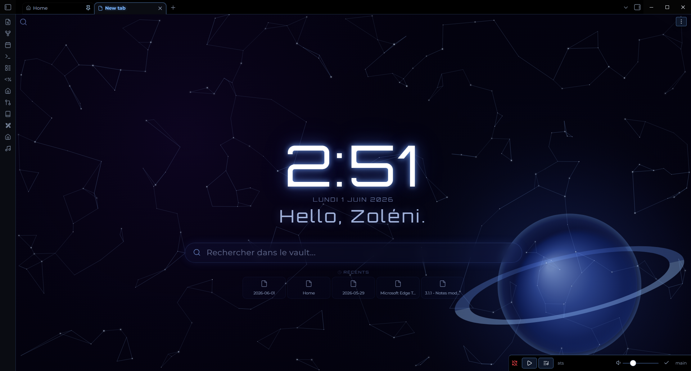

# Tab Galaxy — Obsidian Plugin

A galaxy-themed new tab experience for Obsidian. Every new tab opens an animated starfield with your time, greeting, search, recent files, and more — all floating in deep space.



---

## Features

### New Tab — Galaxy View

Every new empty tab is replaced by the galaxy view:

- **Animated starfield** — twinkling stars, a shooting star, and color nebulae (violet + blue)
- **Constellation lines** — stars connected to their nearest neighbors, softly pulsing
- **Ringed planet** — a blue gas giant with a perspective ring in the corner
- **Live clock** — large Orbitron display, 12h or 24h format
- **Date** — displayed below the clock
- **Greeting** — personalized message with time-of-day and your name
- **Search bar** — opens your preferred search plugin
- **Recent files** — your 5 most recently edited notes
- **Bookmarks** — from all bookmarks or a specific group
- **Quote** — a random quote from the built-in list or your own custom quotes


### Home Dashboard

Create a note named `Home.md` in your vault. Whenever you open it, Tab Galaxy intercepts the navigation and displays a dedicated Home Dashboard instead:

- Same galaxy background as the new tab
- **Navigation buttons** — configurable links to your key notes and folders
- **Recent files** — your 5 most recently edited notes
- **Active projects** — automatically lists notes with `Type: Project` and `status: active` in their frontmatter
- **Tab protection** — clicking any file from the Home Dashboard opens it in a new tab, preserving the Home view

> **Tip:** Use `{{today}}` as a navigation link path to automatically open today's daily note (format `YYYY-MM-DD`).

A pencil button (✏️) in the view header lets you edit `Home.md` directly without leaving the dashboard workflow.

---

## Installation

### Via Community Plugins (recommended)

1. Open Obsidian Settings → Community Plugins
2. Search for **Tab Galaxy**
3. Click Install, then Enable

### Manual

1. Download the latest release from [GitHub Releases](https://github.com/Sikoso774/obsidian-tab-galaxy/releases)
2. Copy `main.js`, `manifest.json`, and `styles.css` into your vault at `.obsidian/plugins/obsidian-tab-galaxy/`
3. Enable the plugin in Settings → Community Plugins

---

## Settings

All settings are available under **Settings → Tab Galaxy**.

| Section | Options |
| --- | --- |
| **Search** | Show/hide top-left search button and inline search bar; choose the search provider plugin |
| **Time** | Show/hide the clock; 12-hour or 24-hour format |
| **Greeting** | Your name (used via `{{name}}`); show/hide greeting; custom greeting text |
| **Recent files** | Show/hide the recent files section |
| **Bookmarks** | Show/hide bookmarks; display all bookmarks or a specific group |
| **Home Dashboard** | Edit the navigation links list |
| **Quotes** | Show/hide quotes; choose between built-in quotes, your own, or both |

### Greeting placeholders

| Placeholder | Value |
| --- | --- |
| `{{greeting}}` | Time-of-day greeting (e.g. *Good morning*) |
| `{{name}}` | Your name from settings (fallback: *explorer*) |

### Supported search providers

- Obsidian Core Quick Switcher
- [Omnisearch](https://github.com/scambier/obsidian-omnisearch)
- [Another Quick Switcher](https://github.com/tadashi-aikawa/obsidian-another-quick-switcher)
- [Quick Switcher++](https://github.com/darlal/obsidian-switcher-plus)

---

## Home Dashboard — Active Projects

Tab Galaxy automatically surfaces your active projects without any manual configuration. Just add this frontmatter to a note:

```yaml
---
Type: Project
status: active
---
```

It will appear in the **Active projects** section of your Home Dashboard.

---

## Credits

- Inspired by [Beautitab](https://github.com/andrewmcgivery/obsidian-beautitab) by Andrew McGivery (MIT License) — architecture and plugin structure
- Font: [Orbitron](https://fonts.google.com/specimen/Orbitron) via Google Fonts
- Part of the [Nebulux](https://github.com/Sikoso774/nebulux) visual ecosystem

---

## Reporting Issues

Open an issue on [GitHub](https://github.com/Sikoso774/obsidian-tab-galaxy/issues) with as much detail as possible — Obsidian version, plugin version, and a screenshot if relevant.

---

## License

MIT
