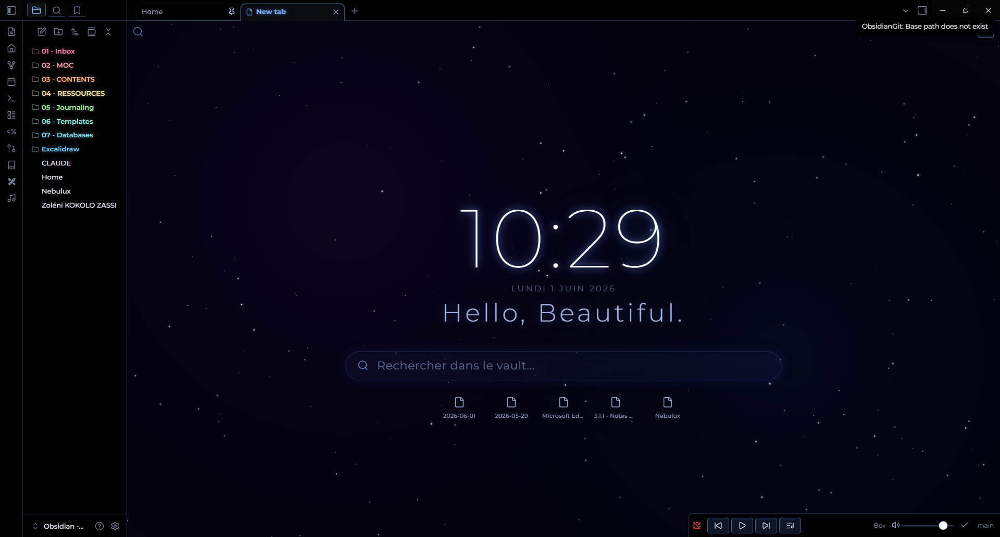

# Supernovae Tab — Obsidian Plugin

A galaxy-themed new tab experience for Obsidian. Every new tab opens an animated starfield with your time, greeting, search, recent files, and more — all floating in deep space.

---

## Features

### New Tab — Galaxy View

Every new empty tab is replaced by the galaxy view:

- **Animated starfield** — twinkling stars, a shooting star, and color nebulae (violet + blue)
- **Constellation lines** — stars connected to their nearest neighbors, softly pulsing
- **Ringed planet** — a blue gas giant with a perspective ring in the corner
- **Live clock** — large Orbitron display, 12h or 24h format
- **Date** — displayed below the clock
- **Greeting** — personalized message with time-of-day and your name
- **Search bar** — opens your preferred search plugin
- **Recent files** — your 5 most recently edited notes
- **Bookmarks** — from all bookmarks or a specific group
- **Quote** — a random quote from the built-in list or your own custom quotes

### Home Dashboard

Create a note named `Home.md` in your vault. Whenever you open it, Supernovae Tab intercepts the navigation and displays a dedicated Home Dashboard instead:

- Same galaxy background as the new tab
- **Three-column layout** that scales itself to the window (side panels open or not): main tabs, clock, date card, link groups, recent notes, streak and calendar, data card
- **Navigation buttons** — configurable links to your key notes and folders, or to any Obsidian command (path `command:<id>`)
- **Recent files** — your 5 most recently edited notes, in a scrolling list
- **Writing streak and calendar** — a big "days in a row" counter and a one-square-per-day calendar of the notes you created (hover for details, click to open the day's journal note)
- **Link groups** — navigation links sharing a group are listed together in a scrolling card (e.g. *Cursus MIAGE*)
- **Data card (DATA NERDS)** — notes created per month (line) and notes per domain (donut), from the sub-folders of a folder you choose
- **Flashcards badge** — optional counter of Spaced Repetition cards to review (due or new) on a navigation button
- **Tab protection** — clicking any file from the Home Dashboard opens it in a new tab, preserving the Home view

> **Tip:** Use `{{today}}` as a navigation link path to automatically open today's daily note (format `YYYY-MM-DD`).

A pencil button (✏️) in the view header lets you edit `Home.md` directly without leaving the dashboard workflow.

---

## Mobile support

> ⚠️ **Supernovae Tab is not stable on phones and tablets yet** (iOS and Android): the animated view can exhaust the mobile app's memory.
>
> Since 1.2.0 the plugin is **disabled on mobile by default**: it only keeps its settings tab there, and new tabs stay Obsidian's default. You can turn **Settings → Supernovae Tab → Disable on mobile** off at your own risk (restart the app to apply). Desktop is unaffected.

---

## Installation

### Via Community Plugins (recommended)

1. Open Obsidian Settings → Community Plugins
2. Search for **Supernovae Tab**
3. Click Install, then Enable

### Manual

1. Download the latest release from [GitHub Releases](https://github.com/Sikoso774/supernovae-tab/releases)
2. Copy `main.js`, `manifest.json`, and `styles.css` into your vault at `.obsidian/plugins/supernovae-tab/`
3. Enable the plugin in Settings → Community Plugins

---

## Settings

All settings are available under **Settings → Supernovae Tab**.

| Section | Options |
| --- | --- |
| **Mobile** | Disable the plugin on phones and tablets (on by default) |
| **Search** | Show/hide top-left search button and inline search bar; choose the search provider plugin |
| **Time** | Show/hide the clock; 12-hour or 24-hour format; date language (French or English) |
| **Greeting** | Your name (used via `{{name}}`); show/hide greeting; custom greeting text |
| **Recent files** | Show/hide the recent files section |
| **Bookmarks** | Show/hide bookmarks; display all bookmarks or a specific group |
| **Home Dashboard** | Take over `Home.md` (on/off); show/hide the writing activity and the data panel; folder whose sub-folders are the domains; edit the navigation links (label, path or `command:<id>`, group, due-cards badge) |
| **Quotes** | Show/hide quotes; choose between built-in quotes, your own, or both |

### Greeting placeholders

| Placeholder | Value |
| --- | --- |
| `{{greeting}}` | Time-of-day greeting (e.g. *Good morning*) |
| `{{name}}` | Your name from settings (fallback: *explorer*) |

### Supported search providers

- Obsidian Core Quick Switcher
- [Omnisearch](https://github.com/scambier/obsidian-omnisearch)
- [Another Quick Switcher](https://github.com/tadashi-aikawa/obsidian-another-quick-switcher)
- [Quick Switcher++](https://github.com/darlal/obsidian-switcher-plus)

---

## Home Dashboard — Writing activity

The dashboard shows how regularly you write. Each note counts once, on the day given by its `Date`, `created` or `création` property (`YYYY-MM-DD`). Notes in `06 - Templates/` and `Home` are ignored.

- **Streak** — consecutive days with at least one note. It stays alive until the end of today: if you have not written yet this morning, yesterday's streak is still shown.
- **Calendar** — the last six months, or one calendar year at a time. Hover a square for the count, click it to open the note named after that day (`YYYY-MM-DD`).
- Turn it off with **Settings → Supernovae Tab → Show writing activity**.

---

## Home Dashboard — Data card

The **DATA NERDS** card shows two charts, drawn as plain SVG (no chart library, no file is read):

- **Notes created per month** over the last twelve months, from the same `Date` / `created` / `création` property as the writing calendar.
- **Notes per domain**: a donut with one slice per sub-folder of the **Domains folder** setting (default `03 - CONTENTS`; the leading number of a folder name is dropped, so `02-Code` reads *Code*). The six biggest domains are listed, the rest is grouped as *Autres*.

Hover a point or a slice for its figures. Turn the card off with **Settings → Supernovae Tab → Show data panel**.

---

## Home Dashboard — Command links

A navigation link whose **path** starts with `command:` runs an Obsidian command instead of opening a note. A command id has the form `plugin-id:command-id` (list them in the developer console with `Object.keys(app.commands.commands)`), for example `command:obsidian-spaced-repetition:srs-review-flashcards` to open the Spaced Repetition deck dialog. If the plugin that owns the command is disabled, a notice says so.

---

## Home Dashboard — Flashcards badge

Tick **Due** on a navigation link (Settings → Navigation links → Edit) to show the number of flashcards to review on that button, the same figure as the [Spaced Repetition](https://github.com/st3v3nmw/obsidian-spaced-repetition) status bar: cards due today plus new, never-reviewed cards, in notes tagged `#flashcards` or `#flashcards/…`. Due cards are read from the `<!--SR:!YYYY-MM-DD,…-->` markers the plugin writes next to each card; new cards are the cards of a note that have no marker yet, counted with the plugin's default syntax (`::`, `:::`, `?`, `??`, `==cloze==`), so it is an estimate if you changed the separators. The badge disappears when there is nothing to review.

---

## Credits

- Inspired by [Beautitab](https://github.com/andrewmcgivery/obsidian-beautitab) by Andrew McGivery (MIT License) — architecture and plugin structure
- Font: [Orbitron](https://fonts.google.com/specimen/Orbitron) via Google Fonts
- Part of the [Nebulux](https://github.com/Sikoso774/nebulux) visual ecosystem

---

## Reporting Issues

Open an issue on [GitHub](https://github.com/Sikoso774/supernovae-tab/issues) with as much detail as possible — Obsidian version, plugin version, and a screenshot if relevant.

---

## License

MIT
